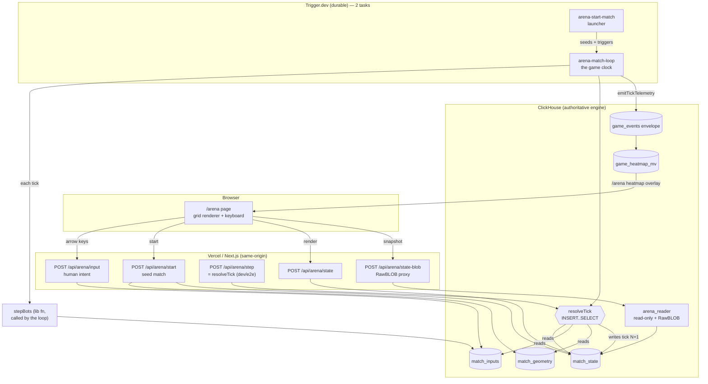

# ClickHouse Arena — architecture

The end-to-end design of the CH-authoritative multiplayer grid game
built on branch `overnight/explore-ch-game`. Every claim below is backed by a file,
route, or query that exists and is tested by `pnpm arena:check` (engine) and
`e2e/arena-multiplayer.spec.ts` (client + API).

## The one-line claim (stated honestly)

**ClickHouse is the authoritative game server** — world state lives in ClickHouse
tables and every tick's rules (movement, wall collision, player-vs-player collision,
coin pickup, hazard death, scoring) are computed by a single ClickHouse
`INSERT … SELECT`. **Trigger.dev is the game clock** — a durable per-match task
advances the world tick by tick. **Vercel/Next.js hosts the client and rendering**.

We do **not** claim "the game renders in ClickHouse" or "no application code":
input capture, rendering, bot policy, and loop orchestration are application code.
The claim is that the **authoritative simulation** is computed by ClickHouse SQL.

## Diagram

## The tick model (see ADR 0002)

Tables (`migrations/0004_arena.ts`): `matches`, `match_players`, `match_geometry`,
`match_inputs`, `match_state`. Tick N+1 = pure SQL function of `match_state(N)` +
`match_inputs(N)` + `match_geometry`. Coins are derived from state history, so a tick
is a single idempotent write. The resolution SQL (`RESOLUTION_SQL` in
`src/lib/arena.ts`) uses:

- **tuple-IN subqueries** for walkable/hazard/coin membership (never a LEFT JOIN,
  which fills unmatched rows with type defaults, not NULL).
- a **synthetic `stay` default** per player unioned into the intent set, so "no input
  → stay" needs no nullable join and idle/dead players resolve cleanly.
- `row_number() OVER (PARTITION BY target, elig ORDER BY player_id)` for the
  player-vs-player collision tiebreak — deterministic (lowest id wins a contested cell).

Determinism is proven: the tick-1 digest is byte-identical run-to-run, and a full
40-tick 4-bot match reproduces an identical digest across independent matches.

## The game clock (see ADR 0002, P2)

`src/trigger/match-loop.ts` is a durable `schemaTask`: each tick it `wait.for`s the
tick interval, lets bots submit intents (`stepBots`), calls `resolveTick`, emits
telemetry, and publishes progress via `metadata`. Idempotency is structural —
`resolveTick` is a no-op if tick T already exists, so a retry fast-forwards and never
double-advances. Bots (`src/lib/arena-bot.ts`) are grid archetypes
(explorer/rusher/cautious) with `mulberry32` determinism, re-seeded per
`(seed, player, tick)` so a retry recomputes identical intents.

The `/api/arena/step` route exposes the *same* `resolveTick`, so local play and the
deterministic e2e step the world explicitly — no sleeps, no Trigger cloud dependency
for tests. In production the durable loop is the clock.

## ClickHouse as web server (see ADR 0003, P4)

`match_state` is served as JSON via `FORMAT RawBLOB` through a dedicated read-only
`arena_reader` user whose SETTINGS PROFILE bakes the `Content-Type` header. The
`/api/arena/state-blob` proxy fetches it server-side and returns the bytes so the CH
host never reaches the browser. Verified: RawBLOB serves JSON (Content-Type from
profile), writes reject `Code: 497`, setting changes reject `Code: 164`.

The same pattern also serves a **live, computed** surface: `POST /api/arena/frame`
returns an `<svg>` of the current tick — geometry, remaining coins, and players —
assembled entirely in SQL (`FRAME_SQL` in `src/lib/arena-frame.ts`) and served via
`FORMAT RawBLOB` through the same read-only user and same-origin proxy. The `/arena`
"Rendered in ClickHouse" toggle shows it as an inert ``, so the engine that
resolves each tick also *draws* it — an `assertSvg` guard keeps the host-never-leaks
guarantee by truncating any trailing bytes.

## The analytics reuse bridge (P1) — the biggest reuse win

`emitTickTelemetry` projects one salient event per player per tick (pos/death/
pickup_coin) into the **existing** `game_events` envelope under `game_id='arena-grid'`,
at `cell*16` so the existing `game_heatmap_mv`'s `floor(x/16)` recovers the exact cell.
The **same materialized view and rollup** aggregate arena events with **no new
aggregation** — only thin emit/read plumbing (`emitTickTelemetry`, `getArenaHeatmap`)
is added, never a new MV or GROUP BY. Single-player batch science and live multiplayer
share one schema.

Honest boundary on the copilot (a claim/code gap worth stating exactly): the
`chat.agent()` copilot's query tools (`heatmap`, `runCounts`, `heatmapDelta` in
`src/lib/queries.ts`) all **default `gameId = DEMO_GAME_ID`** and filter on it, and
`playtest-chat`'s `queryHeatmap` calls them without a gameId. So arena telemetry is
present in the tables the copilot reads and aggregated by the same MV, **but the copilot
won't surface it until its tools point at `game_id='arena-grid'`** — a one-parameter
plumbing change, *not* "no change." That change was deliberately **not** made here:
`playtest-chat` sits behind the inherited disqualifier gate and can only be verified with
the live Trigger + AI stack, which this run doesn't touch. So the tested claim is narrow
and true — arena events flow into the shared envelope and the existing MV rolls them up
(`arena:check` bridge scenario; `getArenaHeatmap` + `/arena` overlay, e2e-asserted) — and
the copilot integration is a scoped, operator-verified follow-up.

## Measured scale (local single-node, honest lower bound)

`pnpm arena:bench` on the real level1 map (50×38, 1900 cells), CH 26.7 static binary
on one laptop:

| players | resolution avg | p95 | player-updates/sec | state rows |
| --- | --- | --- | --- | --- |
| 24 | 34.68 ms | 38.83 ms | 692 | 1464 (24×61) |
| 48 | 34.74 ms | 38.98 ms | 1382 | 1968 (48×41) |

Resolution latency is **flat as players double** — the tick is a set-based query
whose per-player cost is negligible. At a 500 ms tick that is ~7% of the budget:
real-time headroom for tens of players per match on a single node. These are local
numbers, not a cloud claim.

Per-tick breakdown (24 players): `resolveTick` 36 ms (the DB engine), `stepBots` 66 ms,
`emitTickTelemetry` 12 ms. **Profiled honestly:** `stepBots` is dominated by the
*durable* `match_inputs` insert (~60 ms), not geometry (an initial wrong guess —
caching geometry + the bot roster via `loadStepContext` barely moved it). The insert
must be durable because the loop reads the intents back at `resolveTick(tick+1)`;
fire-and-forget breaks determinism (a not-yet-flushed intent reads as `stay`). This
read-after-write cost is inherent to keeping the authoritative intents in the DB, and
sits comfortably within a 500 ms tick. A future optimization (not needed at this tick
rate) computes bot intents in-process and injects them into the resolution, skipping the
per-tick durable round-trip. The DB *resolution* — the "database as engine" number — is
the fast, flat, scalable part.

## When the database-as-engine fits (and when it doesn't)

The honest boundary, stated before a judge does: **this is not how you build a twitch
shooter.** An OLAP columnar store doing single-row point-writes with a durable
read-after-write each tick is the wrong engine for 60 fps action — that is
Redis/authoritative-game-server territory, single-digit-ms per update.

Where it genuinely fits — and where the "fit" argument is real, not a stunt:

- **Tick/turn-based games at a human cadence** (strategy, roguelike, async board/tactics,
  a `.io` grid game) where an authoritative tick every ~200–1000 ms is natural. There the
  resolution being a *set-based SQL query over the whole match* is an asset: it is flat in
  player count (24→48 players, same ~36 ms) and trivially auditable/replayable.
- **When the same system must serve live play AND deep analytics/replay/what-if over
  many matches** — ClickHouse's actual strength. The arena's telemetry bridge and the
  same `chat.agent()` copilot query layer (one `gameId` param away) are the payoff: one
  schema answers "resolve this tick" *and* "where do rushers die across 10k matches" with
  no second datastore and no ETL.

So the claim is bounded: for the *tick-based, analytics-heavy* class of game, making the
warehouse the authoritative engine is a legitimate, coherent choice — you get a
deterministic replayable server and a full analytics stack from one store. Outside that
class, don't.

## Delta vs the current main submission

Main today: single-player Phaser platformer + offline headless bot swarm + telemetry
into ClickHouse + `chat.agent()` copilot. Arena adds a **new game mode** (it does not
make the Phaser platformer "run in ClickHouse") where the DB is the authoritative
multiplayer server and Trigger is the clock. It reuses main's geometry, bot
archetypes, telemetry envelope, and heatmap MV (the copilot's query layer is one
`gameId` param away — see the reuse section). New surface: 5 tables (one
migration), `src/lib/arena*.ts`, 7 same-origin API routes
(start/step/input/state/match/state-blob/heatmap), `/arena` page, 2 Trigger tasks
(match-loop clock + match launcher), and committed engine + e2e tests. Nothing in main
is modified.

## Honest limitations

- **No same-tick trains/swaps** — a move into a currently-occupied cell is blocked
  even if the occupant vacates the same tick (deterministic, single-pass).
- **Durable per-tick intent insert** (~60 ms) is the loop's client-side cost — the
  price of read-after-write consistency on MergeTree. Fine within a 500 ms tick; a
  future opt injects bot intents in-process. (Geometry + bot roster are already cached
  per match via `loadStepContext`.)
- **Trigger loop not yet executed in the cloud** — the loop's mechanics are proven
  locally via the identical `resolveTick`; capturing a live Trigger run id is an
  operator step (needs the dashboard `CLICKHOUSE_URL` reachable).
- Numbers are single-node local, not the cloud instance.
